# 📊 Sales Dashboard (Python)

This repository contains Python scripts and visualizations analyzing **e-commerce sales data**.  
It covers multiple business scenarios including:
- Top-selling products  
- Impact of discounts  
- Customer behavior  
- Weekend vs. weekday sales  
- Forecasting future sales trends  

---

## 📂 Project Structure


Sales-Dashboard/
* ├── Data/ # Contains sales datasets (e.g., sales_data.csv)
* ├── output/ # Auto-generated charts & reports
* ├── scripts/ # Analysis scripts
* │ ├── task1.py
* │ ├── task2.py
* │ ├── task3.py
* │ ├── … (continue list)
* │ └── task17.py
* └── README.md # Project documentation (this file)

## 🛠️ Technologies Used
- **Python 3**
- **Pandas, NumPy** – data analysis
- **Matplotlib, Seaborn** – data visualization
- **Jupyter / PyCharm** – development

---

## 🚀 How to Run
1. Clone the repository:
   ```bash
   git clone https://github.com/HeyChamp29/sales-dashboard-project.git
   cd sales-dashboard-project/Sales-Dashboard


---

## 🛠️ Technologies Used
- **Python 3**
- **Pandas, NumPy** – data analysis
- **Matplotlib, Seaborn** – data visualization
- **Jupyter / PyCharm** – development

---

## 🚀 How to Run
1. Clone the repository:
   ```bash
   git clone https://github.com/HeyChamp29/sales-dashboard-project.git
   cd sales-dashboard-project/Sales-Dashboard

2.Install dependencies (if not already installed):

pip install pandas numpy matplotlib seaborn

3. Run a script (example):

python task1.py


## Charts will be saved in the output/ folder.

# 📌## 📊 **Example Insights**

## **This dashboard provides insights such as:**

- 📈 Top 5 best-selling products  
- 🛒 Customer purchase frequency  
- 💸 Discount impact on revenue  
- 📅 Weekday vs Weekend sales trends  
- 🔮 Forecasting future sales trends  


## 📊 Example Results

Here are the key visual insights generated from the project:

- **Task 1: Sales Overview**  
  

- **Task 2: Regional Sales Performance**  
  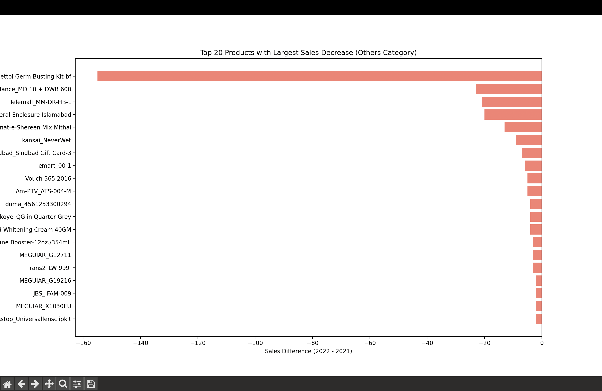

- **Task 4: Revenue Trends**  
  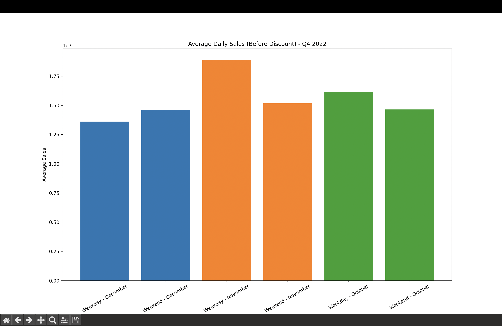

- **Task 5: Top Performing Products**  
  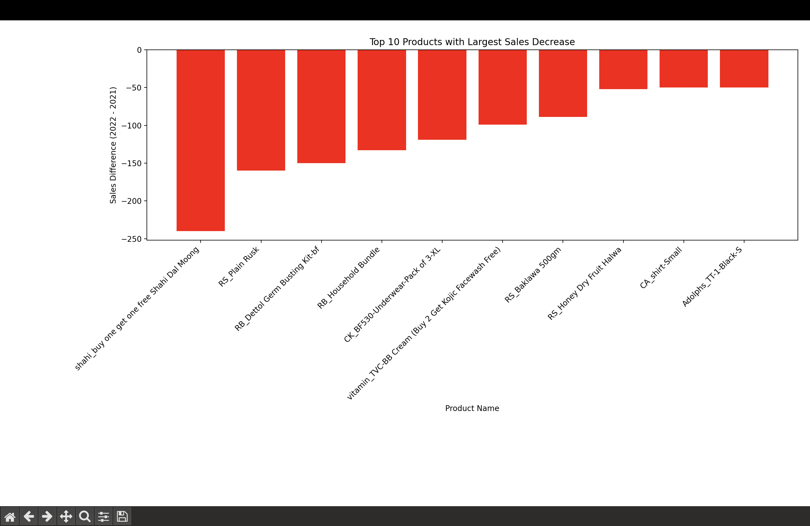

- **Task 6: Sales by Month**  
  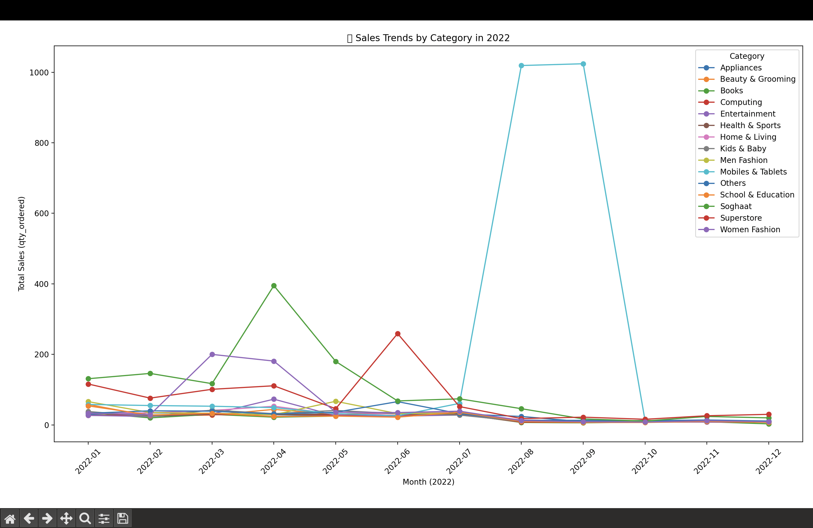

- **Task 7: Profit Margins**  
  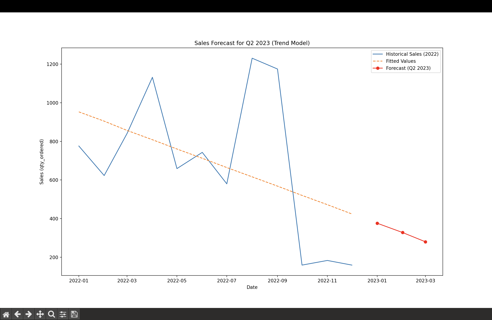

- **Task 8: Sales by Customer Segment**  
  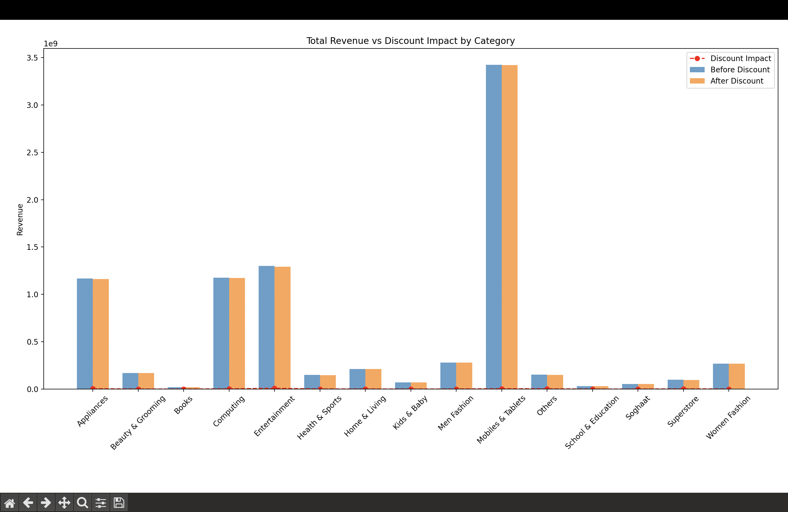

- **Task 9: Order Quantity Trends**  
  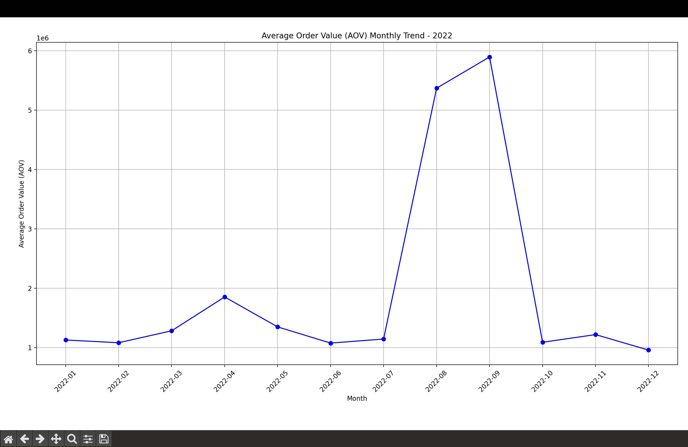

- **Task 11: Sales by Country**  
  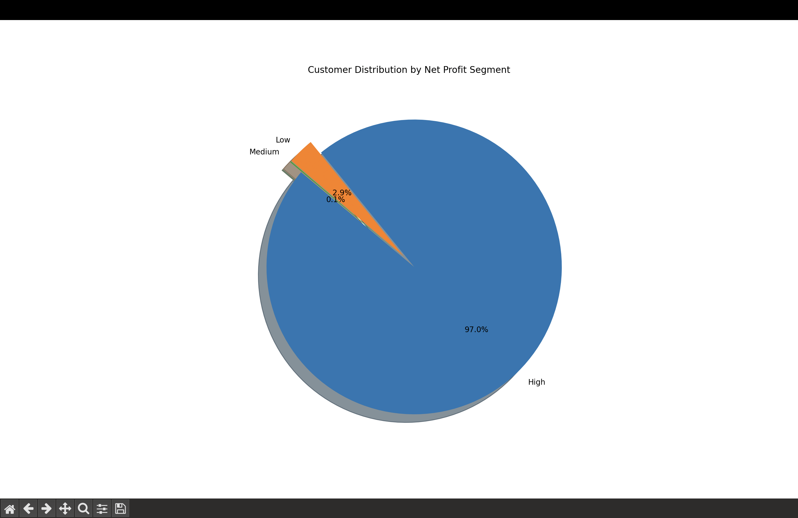

- **Task 12: Seasonal Sales Insights**  
  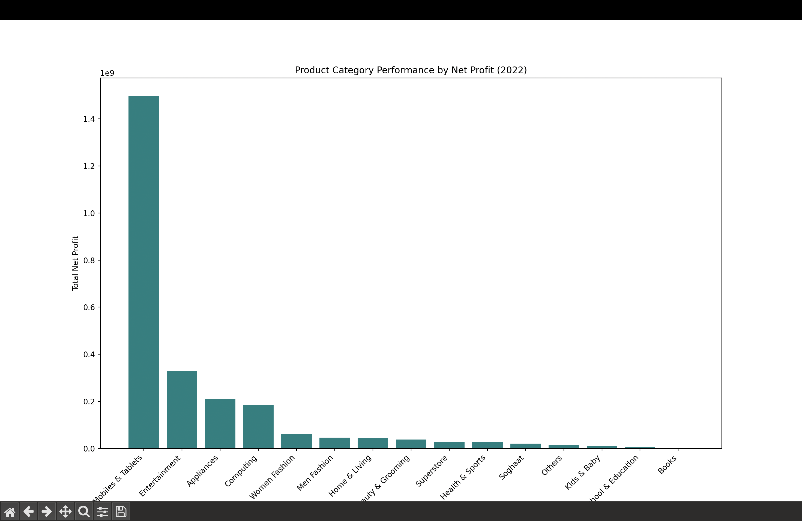

- **Task 14: Discounts Impact Analysis**  
  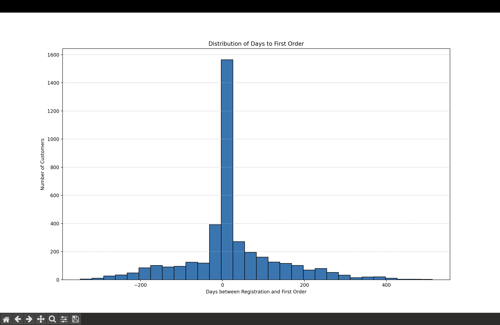

- **Task 15: Customer Lifetime Value**  
  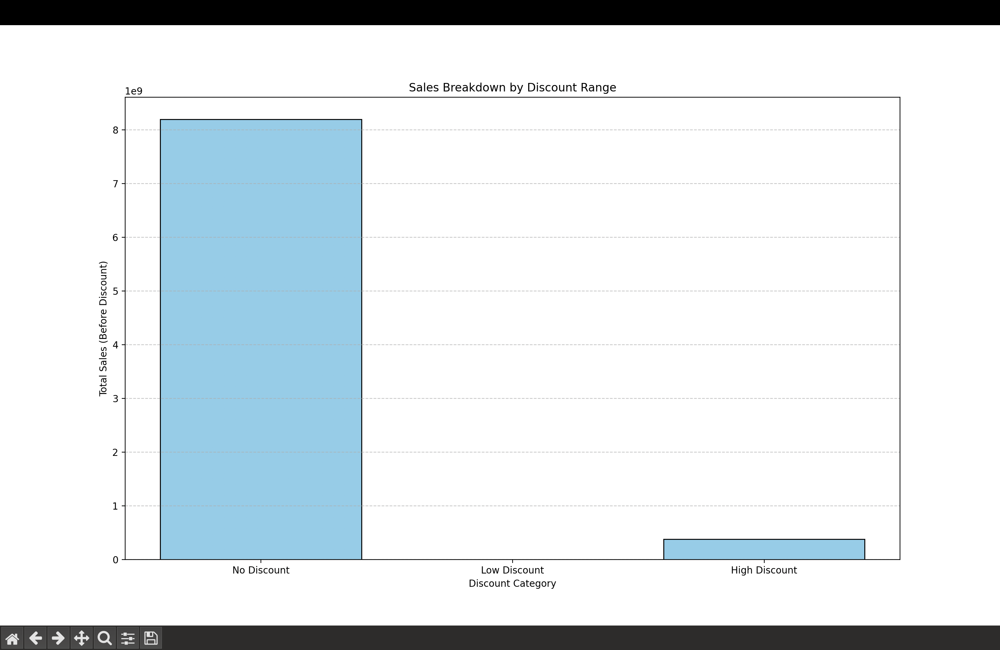

- **Task 16: Region-wise Growth Comparison**  
  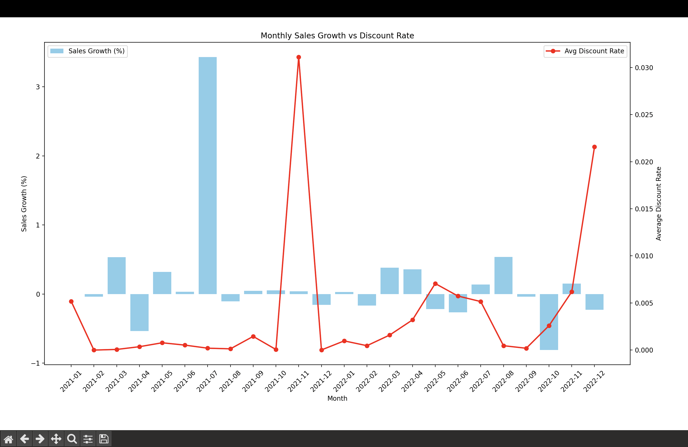

- **Task 17: Final Dashboard Snapshot**  
  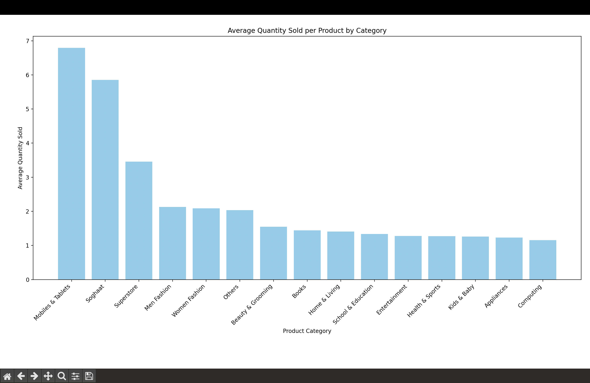


# **👤 Author**

* Aman Shah
* 📧 [amanshah2916@gmail.com]()
* 🔗 [GitHub Profile]https://github.com/HeyChamp29


